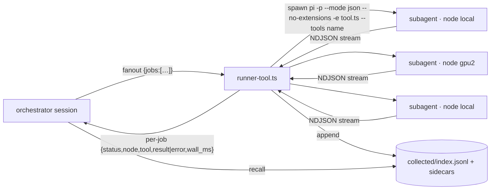

# pi-fanout

Delegate bounded tool calls from a [pi](https://www.npmjs.com/package/@earendil-works/pi-coding-agent)
coding-agent session to cheap **local-model subagents**, run K of them **concurrently**, and
file every return into an **append-only collection store** a later reasoning pass can load.

Status: **v0, extracted.** The mock suites, typecheck and identifier scan pass offline. The
live path (a real pi subprocess talking to a real model server) is the same code that ran
daily in the private repo it came from, but it has **not** been re-driven from this export
yet. Treat it as a candidate until you have run it against your own model server.

## The problem

Small local models (2–9B) fail at open-ended delegation: hand one a whole investigation and
it loops, hallucinates tool arguments, or loses the thread. Hand the same model one
*prescribed* call — "run this tool with exactly these arguments and report the result" —
and it succeeds almost every time. So the split is:

- **CODE owns** dispatch, routing, parallelism, result extraction, status classification and
  filing.
- **The small model owns** one narrow slot: make the call, report verbatim, say `DONE` or
  `ABORT`.

The orchestrating model (which can itself be a small local model) makes **one** tool call
and gets structured per-job results back. It never has to emit K well-formed parallel calls.

## What you get

Four pi tools, registered by two extension files:

| tool | file | what it does |
|---|---|---|
| `scout` | `src/scout-tool.ts` | Delegate a single-fact **repository lookup** ("what port does X listen on?"). The subagent runs bare with only `read,grep,find,ls`, answers in one sentence with a `file:line` citation. |
| `runner` | `src/runner-tool.ts` | Delegate **one prescribed call** of any tool active in the parent session (built-in or extension) to a subagent on a node. Returns the result plus a deterministic `done / abort / tool_error / unknown` status. |
| `fanout` | `src/runner-tool.ts` | Delegate **K prescribed calls concurrently** (one subprocess each, `Promise.all`). Per-job results; one job's failure never sinks the batch. |
| `recall` | `src/runner-tool.ts` | Load what `runner`/`fanout` **collected**, filtered by tool/node/status/phase/since, under a character budget with sidecar hydration. |



### Tool inheritance

The runner is tool-agnostic. It reads the parent session's live toolset through
`pi.getActiveTools()` / `pi.getAllTools()`, resolves the requested tool to the extension file
that registered it (`sourceInfo.path`), and launches the subagent with
`--no-extensions -e <that file> --tools <that name>`. The subagent therefore has **exactly one
tool** and none of the parent's hooks, packages or skills.

### Deterministic status

The small model's `DONE`/`ABORT` text is never trusted alone. `parseRunnerStream` classifies
from the NDJSON event stream: an `ABORT` sentinel wins, then a `tool_execution_end` with
`isError`, then `DONE`, else `unknown`. The verbatim tool result is lifted from the stream
separately from the model's narration, and the store files the **data**, not the narration.

### Collection store

With `RUNNER_COLLECT_DIR` set, every delegated return (success *and* failure) is appended as
one JSON line to `index.jsonl`; results over the inline cap go to a `<id>.txt` sidecar. Writes
are best-effort: a filing fault is logged as a forensic `collect_seam` entry and never fails
the dispatch. `recall` decides inclusion newest-first by recorded size, hydrates only what
fits the budget, and stubs the rest with `over_budget: true` and a real `result_ref`.

### Error contract

- `Error: …` — model-visible and actionable (unknown tool, unknown node, empty args, pi
  binary missing).
- `Seam: …` — infrastructure fault (timeout, provider/serving error, empty stream). Kept
  distinct so forensics can score harness unreliability separately from model error.

Every dispatch also lands a `pi.appendEntry` record (node, model, tool, args, status,
tool-call count, wall time, exit code, preview) in the session log.

## Quick start

Requirements:

| what | version | why |
|---|---|---|
| Node.js | ≥ 22.19 | pi's engine floor |
| pi | **0.84.2** (pinned in `PI_VERSION`, installed by `npm ci`) | the extension API and the `-p --mode json` stream shape this code is verified against |
| a model server | Ollama (or any OpenAI-compatible endpoint) | only for live use — the gates below need none |
| a small tool-calling model | e.g. `qwen2.5-coder:7b` (placeholder) | override with `SCOUT_MODEL` |
| `just` | optional | recipe runner for the gates |

```bash
git clone <this repo> pi-fanout && cd pi-fanout
npm ci                  # pinned pi + jiti + typescript
npm run setup           # links pi's non-hoisted packages, checks PI_VERSION
npm run typecheck       # tsc strict against pi's real .d.ts
npm test                # mock suites: no model, no network, no subprocess
npm run scan            # identifier-safety scan (a release gate)
```

Live use (needs a model server):

```bash
# 1. tell pi about your local server — merge config/models.json into ~/.pi/agent/models.json
#    and make sure the model id there is one you have pulled:
ollama pull qwen2.5-coder:7b

# 2. pick the scout model (provider/id, must match models.json)
export SCOUT_MODEL=ollama/qwen2.5-coder:7b

# 3. load the tools into a session
just ext          # = pi -e src/scout-tool.ts -e src/runner-tool.ts
```

Then, in the session: *"Use scout to find what port scripts/server.sh listens on."* or
*"Use fanout to grep for TODO in src/ and test/ as two jobs."*

To install permanently, add this directory to `packages` in `~/.pi/agent/settings.json`
(the `pi` manifest in `package.json` lists both extensions).

## Nodes

A **node** is a name that maps to a `provider/model` ref. Out of the box there is one node,
`local`, pointing at the placeholder model on your own machine. Add more by pointing a
provider in `models.json` at another machine's server and naming it:

```bash
export SCOUT_MODEL=ollama/qwen2.5-coder:7b          # the "local" node
export SCOUT_MODEL_GPU2=gpu2/qwen2.5-coder:7b       # defines node "gpu2" (provider "gpu2" in models.json)
export SCOUT_DEFAULT_NODE=gpu2                       # where an unqualified job goes (default: local)
```

`fanout` jobs on different nodes run on different machines; jobs on the same node share that
node's GPU. An unknown node name is a model-visible `Error:` listing the known nodes.

## Environment knobs

| variable | default | meaning |
|---|---|---|
| `SCOUT_MODEL` | `ollama/qwen2.5-coder:7b` | model ref for node `local` |
| `SCOUT_MODEL_<NAME>` | — | define node `<name>` |
| `SCOUT_DEFAULT_NODE` | `local` | node for jobs that omit `node` |
| `SCOUT_PI_BIN` / `RUNNER_PI_BIN` | `./node_modules/.bin/pi`, else `pi` | pi binary to spawn |
| `SCOUT_THINKING` | provider default | `off` forces `--thinking off` for scout (runner always off) |
| `SCOUT_TIMEOUT_MS` | 180000 | scout per-call timeout |
| `SCOUT_MAX_CHARS` | 4000 | scout answer cap |
| `RUNNER_TIMEOUT_MS` | 300000 | runner/fanout per-job timeout |
| `RUNNER_MAX_CHARS` | 8000 | caller-facing result cap (the store keeps the full text) |
| `RUNNER_MAX_FANOUT` | 8 | jobs per fanout call |
| `RUNNER_COLLECT_DIR` | unset = off | collection store directory |
| `RUNNER_COLLECT_MAX_INLINE` | 32768 | inline result cap before a sidecar |
| `RUNNER_COLLECT_PHASE` | `collect` | phase label on filed records |
| `RUNNER_RECALL_MAX_CHARS` | 16000 | total full-text budget per `recall` call |

## Verification

Nothing here is "done" on reading right. Three gates, all offline:

1. `npm run typecheck` — `tsc --strict` over `src/` against the installed pi `.d.ts`.
2. `npm test` — `test/run-scout-tool.mjs` (37 checks) and `test/run-runner-tool.mjs`
   (138 checks) load the real extension files through jiti with a mocked pi API and an
   injected spawner and filesystem. They cover argument-drift coercion, the argv shape, the
   status classifier, isolation and a concurrency proof for fanout, the store's write path,
   and recall's budget logic. The runner unsets inherited `SCOUT_*`/`RUNNER_*` env so a
   session's settings cannot leak into the assertions.
3. `npm run scan` — `scripts/ip_scan.sh` greps every tracked text file for identifiers that
   commonly leak from private repos (private and public IPs, UUIDs, ticket ids, vendor console
   URLs, corporate hostname schemes, credentials, hashes, home paths) and fails on any HIGH/MED
   hit. Reusable as a release gate in any repo.

The live path is verified separately and manually: start a model server, `just ext`, and
watch `pi.appendEntry` records land in the session log.

## Layout

```
src/scout-tool.ts        scout: single-fact repo lookup subagent
src/runner-tool.ts       runner + fanout + recall (shared dispatch spine, injected spawn/fs)
src/lib/scout-core.ts    stream parser, arg coercion, node table, scout prompt   (pure)
src/lib/runner-core.ts   tool inheritance, argv, runner prompt, status classifier (pure)
src/lib/collect-core.ts  record schema, sidecar split, filter, budget helpers    (pure)
test/run-*.mjs           jiti mock suites
scripts/setup.sh         link pi packages, check PI_VERSION
scripts/run-suites.sh    suite runner (exit code AND "ALL PASSED" marker)
scripts/ip_scan.sh       identifier-safety gate
config/models.json       minimal Ollama provider stanza for ~/.pi/agent/models.json
justfile                 setup / gate-tsc / gate-jiti / gate-scan / gate / ext
PI_VERSION               0.84.2
```

## Design notes

- **Explicit dispatch, not autonomy.** The caller names tool and args. A subagent that
  chooses its own tools is the regime where small models fail.
- **Bare subagents.** `--no-extensions --no-skills --no-context-files --thinking off`. Any
  harness behavior the parent carries would suppress a small model's tool calling.
- **Never trust the sentinel alone.** Status is classified from stream events; the model's
  `DONE` is one input.
- **Arg-drift tolerance.** Small models rename parameters (`tool_name`, `arguments`,
  `target`) and double-encode arrays as strings with trailing commas. Every entry point
  coerces before it validates.
- **Best-effort audit, never-fail dispatch.** A logging or filing fault is recorded and
  swallowed; the live return is the source of truth.
- **Pinned dependency.** pi's extension API moves. `PI_VERSION` names the version this code
  was verified against; `scripts/setup.sh` warns on drift.

## License

Apache-2.0. See `LICENSE`.
