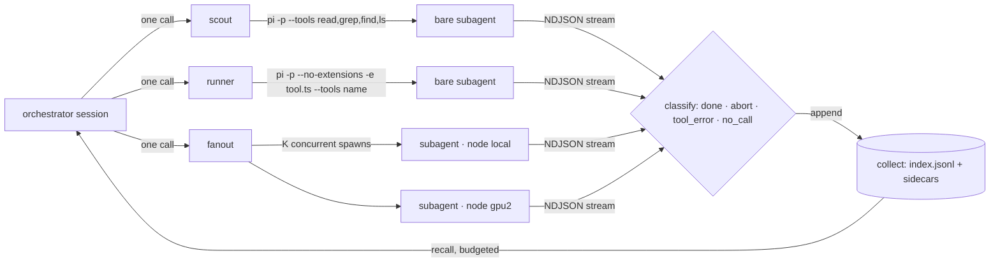

# Kinase

A harness that activates agents: **scouts**, **fanout**, and a **runner** over
[pi](https://www.npmjs.com/package/@earendil-works/pi-coding-agent).

Kinase is a domain-neutral agent harness. A *profile* wires it to a situation: which tools
the agents may call, which model sits on which machine, what gets collected. The first
profile was digital forensics and incident response; the harness underneath never cared.
This repository is the harness, extracted from a larger private one and re-verified on
its own.

**Why Kinase?** A kinase is the enzyme that switches on a signaling cascade: one
phosphorylation, and a whole pathway lights up downstream. It was named by a biochemistry
graduate who wanted the orchestrator to do exactly that, one call that activates many
bounded workers.

## The idea

Small local models (2–9B) fail at open-ended delegation: hand one a whole investigation and
it loops or invents tool arguments. Hand it one *prescribed* call, "run this tool with
exactly these arguments and report the result", and it succeeds almost every time. So
**code owns** dispatch, concurrency, result extraction and status; **the small model owns**
one slot: make the call, report it, say `DONE` or `ABORT`. The orchestrator makes one call,
gets per-job results back, and never has to take a small model's word for anything: status
is read from the subprocess event stream, and a `DONE` with zero tool calls is `no_call`.

## Architecture



| tool | what it does |
|---|---|
| `scout` | One single-fact repository lookup by a read-only subagent, answered in one sentence with a `file:line` citation. |
| `runner` | One prescribed call of any tool active in the parent session, run by a subagent on a named node (a machine with a model server). Returns the verbatim tool output plus a status. |
| `fanout` | K prescribed calls at once, one subprocess each. One job's failure never sinks the batch. |
| `recall` | Load what earlier jobs collected, filtered by tool, node, status or time, under a character budget. |

Each subagent is a headless `pi -p` process that emits one JSON event per line; the harness
reads that stream, lifts the verbatim tool output, classifies the status, and appends a
record (node, model, tool, args, status, tool-call count, wall time) to a collection store.
A store write that fails is logged and never fails the job.

## What a reviewer needs to run it

| requirement | version | why |
|---|---|---|
| Node.js | ≥ 22.19 | pi's engine floor |
| pi | **0.84.2**, pinned in `PI_VERSION` and installed by `npm ci` | the extension API and the `-p --mode json` stream shape this code is verified against |
| a model server | Ollama at `localhost:11434`, or any OpenAI-compatible endpoint | live use only; the offline gates need none |
| a small tool-calling model | `qwen2.5:7b` is the placeholder | must actually emit tool calls through your server (see below) |
| `just` | optional | recipe runner |

## 30-second demo

Live, from this export, against Ollama 0.32 on one machine. Orchestrator `qwen3-coder:30b`,
three subagents on `qwen2.5:7b`, three bounded jobs in one `fanout` call:

```bash
npm ci && npm run setup                 # pinned pi, linked, version-checked
# merge config/models.json into ~/.pi/agent/models.json, then:
ollama pull qwen2.5:7b && ollama pull qwen3-coder:30b
export KINASE_ORCHESTRATOR=ollama/qwen3-coder:30b
just demo                               # = scripts/demo.sh
```

Output of `just demo`, 2026-09-12 local time (store timestamps are UTC; the store path is
shortened, nothing else edited):

```text
orchestrator: ollama/qwen3-coder:30b   subagents: ollama/qwen2.5:7b   store: ./collected

== fanout result (per-job manifest)
  job 0  done       grep  node=local    6818 ms  runner-tool.ts:447:   pi.registerTool(
  job 1  done       ls    node=local    5823 ms  demo.sh
  job 2  done       read  node=local    5895 ms  0.84.2
== fanout details: {"jobs":3,"ok":3,"statuses":["done","done","done"],"total_wall_ms":6820,"max_wall_ms":6818}

orchestrator tool calls: 1   fanout calls: 1   final text: "fanout complete"

== collection store: ./collected/index.jsonl (last 3 records)
  {"ts":"2026-09-13T01:03:22.160Z","phase":"collect","node":"local","tool":"ls","status":"done"}
  {"ts":"2026-09-13T01:03:22.235Z","phase":"collect","node":"local","tool":"read","status":"done"}
  {"ts":"2026-09-13T01:03:23.150Z","phase":"collect","node":"local","tool":"grep","status":"done"}
DEMO OK
```

Three subprocesses ran at once: total wall time 6820 ms against a slowest job of 6818 ms.
Each record carries `tool_calls: 1` and the verbatim tool output; the orchestrator made one
call and received that same array.

Interactively: `just ext` loads the four tools into a pi session. Then, in the session:
*"Use fanout to grep for TODO in src/ and test/ as two jobs."*

**On placeholder models.** The first live run used `qwen2.5-coder:7b` as the subagent.
Through Ollama it never invoked its tool: it echoed the call as JSON text, invented output,
and typed `DONE`. The classifier now files that as `no_call`; re-run with that model, all
three jobs came back `no_call`, `tool_calls: 0`, one reporting a version that does not
exist. `qwen2.5:7b`, `llama3.1:8b`, `granite4.1:3b` and `gemma4:e4b` did call the tool.

## Verify without a model

Three gates, all offline, all in CI:

```bash
npm run typecheck   # tsc --strict over src/ against pi's installed .d.ts
npm test            # 182 checks: the real extension files loaded through jiti with a
                    # mocked pi API, an injected spawner and an in-memory filesystem
npm run scan        # identifier-safety scan over every tracked text file
```

The mock suites cover tolerance for renamed arguments (small models rename parameters), the
subagent command line, the status classifier including `no_call`, fanout isolation and a
concurrency proof, the store's write path and recall's budget. The scan fails on any IP,
ticket id, vendor console URL, credential-shaped assignment, hash or home path, plus an
`IP_SCAN_PRIVATE_TERMS` list held as a CI secret. `scripts/ip_scan_selftest.sh` is its
positive control: a planted tree must fail, a clean tree must pass. That control caught two
patterns that had been silently dead under GNU grep.

**Local setup.** The private terms are the author's: an employer name, a hostname scheme, a
case-id form. They live in a private repository and reach this one two ways. CI enforces
them through the `IP_SCAN_PRIVATE_TERMS` secret, and `scripts/setup-private-terms.sh`
fetches them into the git-ignored `scripts/ip_scan.private` and installs a pre-commit hook
that refuses to commit unless they are loaded. In any other clone the script prints one line
and exits, and the scanner runs its public classes only.

## Configuration

`SCOUT_MODEL` names the `local` node's model, `SCOUT_MODEL_<NAME>` adds a node per machine,
`RUNNER_COLLECT_DIR` turns the store on. The headers of `src/scout-tool.ts` and
`src/runner-tool.ts` list every knob with its default.

## Roadmap

Profiles, each a small directory of tool allowlists, node maps and prompts over the same
harness: **learning**, **coding**, **research**, **threat intel**, and **red / blue / purple**
team exercises. The harness gains a profile loader.

## Provenance

Extracted from a larger private harness where this code ran daily. Everything specific to
the original domain stayed behind; the identifier scan is the gate that says so.

## License

Apache-2.0. Copyright 2026 Mark Peters. See `LICENSE`.
